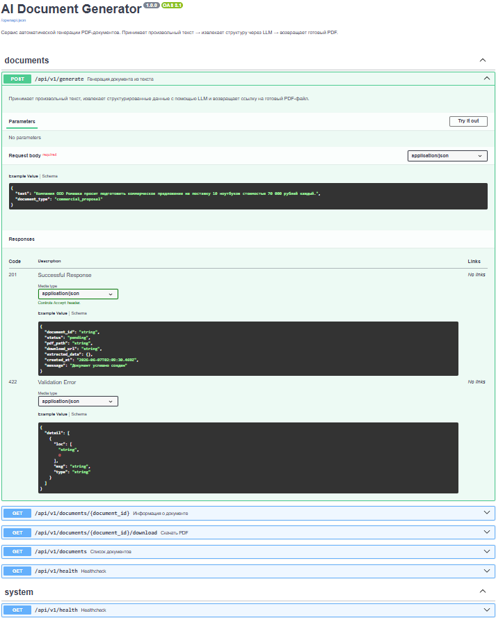
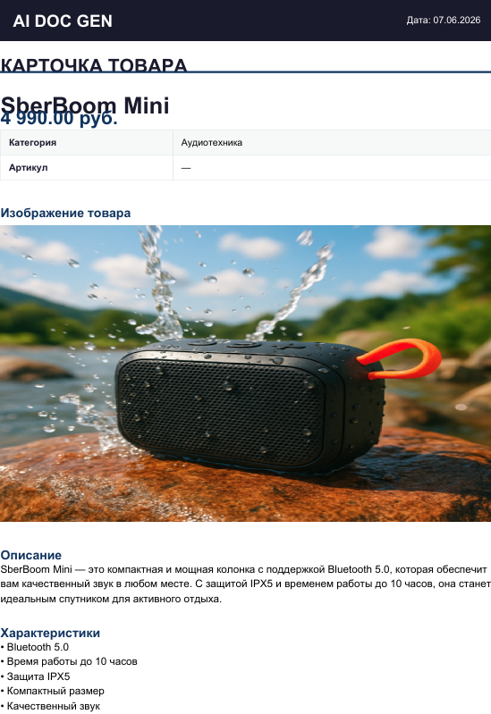
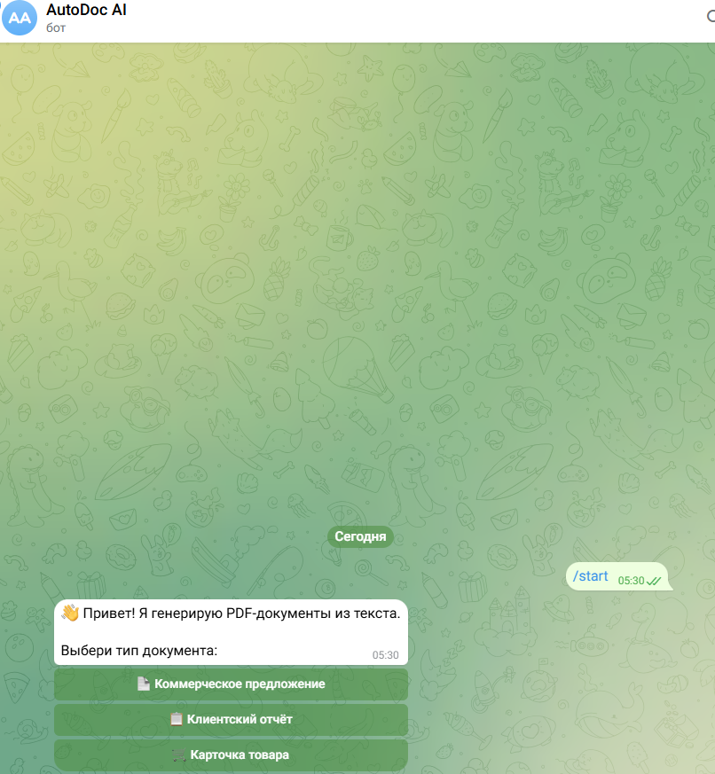

# 🤖 AI Document Generator

<p align="center">
  
  
  
  
  
</p>

<p align="center">
  Сервис автоматической генерации PDF-документов из произвольного текста.<br/>
  Текст → LLM → Structured JSON → PDF
</p>

---

## 📋 Содержание

- [Бизнес-задача](#-бизнес-задача)
- [Архитектура](#-архитектура)
- [Стек технологий](#-стек-технологий)
- [Быстрый старт](#-быстрый-старт)
- [Docker-запуск](#-docker-запуск)
- [Локальный запуск](#-локальный-запуск)
- [API — примеры запросов](#-api--примеры-запросов)
- [Структура проекта](#-структура-проекта)
- [Конфигурация](#-конфигурация)
- [Telegram-бот](#-telegram-бот)
- [Скриншоты](#-скриншоты)

---

## 💼 Бизнес-задача

Компании ежедневно создают десятки однотипных документов: коммерческие предложения, клиентские отчёты, карточки товаров. Ручное заполнение шаблонов занимает время и приводит к ошибкам.

**AI Document Generator решает это за 3 шага:**

1. Пользователь отправляет любой неструктурированный текст — диалог с клиентом, голосовую транскрипцию, описание заказа
2. LLM (GPT-4o) извлекает ключевые данные и возвращает валидированный JSON
3. Сервис автоматически формирует PDF с профессиональным форматированием

**Результат:** документ готов за 10–20 секунд вместо 15–30 минут ручного труда.

---

## 🏗 Архитектура

```
Пользователь
     │
     │ Произвольный текст
     ▼
┌─────────────┐
│   FastAPI   │  ← REST API / Swagger UI
└──────┬──────┘
       │
       ▼
┌─────────────────┐
│  AIProcessor    │  ← OpenAI GPT-4o через ProxyAPI
│  Service        │    Prompt Engineering + JSON-парсинг
└──────┬──────────┘
       │
       │ Structured JSON (Pydantic v2)
       ▼
┌─────────────────┐
│  PDFGenerator   │  ← ReportLab
│  Service        │    Три типа документов
└──────┬──────────┘
       │
       ▼
┌─────────────────┐
│   SQLite DB     │  ← История + статусы
│   + reports/    │  ← PDF-файлы на диске
└─────────────────┘
       │
       ▼
  📄 PDF-файл  ←──────────── Telegram Bot (aiogram 3)
```

**Слои приложения:**
| Слой | Ответственность |
|------|----------------|
| `app/api/` | HTTP-маршруты, валидация запросов |
| `app/services/` | Бизнес-логика: AI, PDF, оркестрация |
| `app/models/` | Pydantic-схемы данных |
| `app/prompts/` | Системные промпты для LLM |
| `app/database/` | Репозиторий SQLite через aiosqlite |
| `app/utils/` | Конфигурация (pydantic-settings) |

---

## 🛠 Стек технологий

| Категория | Технология |
|-----------|-----------|
| **Backend** | Python 3.11+, FastAPI, uvicorn |
| **AI / LLM** | OpenAI GPT-4o через ProxyAPI |
| **Data validation** | Pydantic v2 |
| **PDF** | ReportLab |
| **Database** | SQLite + aiosqlite |
| **Telegram** | aiogram 3, aiohttp-socks (SOCKS5) |
| **DevOps** | Docker, Docker Compose |
| **Testing** | pytest, pytest-asyncio, httpx |

---

## ⚡ Быстрый старт

### 1. Клонировать репозиторий

```bash
git clone https://github.com/KirillTomenko/ai-document-generator.git
cd ai-document-generator
```

### 2. Настроить окружение

```bash
cp .env.example .env
# Открыть .env и вставить PROXYAPI_API_KEY
```

### 3. Запустить через Docker

```bash
docker compose up --build
```

Готово. API доступно на `http://localhost:8000/docs`

---

## 🐳 Docker-запуск

```bash
# Только API
docker compose up --build

# API + Telegram-бот
docker compose --profile telegram up --build

# Фоновый режим
docker compose up -d

# Логи
docker compose logs -f api

# Остановить
docker compose down
```

Файлы PDF сохраняются в `./reports/` на хосте через volume-маппинг.

---

## 💻 Локальный запуск

```bash
# Создать виртуальное окружение
python -m venv .venv
.venv\Scripts\activate      # Windows
# source .venv/bin/activate  # Linux/macOS

# Установить зависимости
pip install -r requirements.txt

# Настроить .env
cp .env.example .env

# Запустить
python main.py
```

**Запуск тестов:**
```bash
pytest tests/ -v
```

---

## 🔌 API — примеры запросов

### Генерация коммерческого предложения

```bash
curl -X POST http://localhost:8000/api/v1/generate \
  -H "Content-Type: application/json" \
  -d '{
    "text": "Компания ООО Ромашка просит подготовить коммерческое предложение на поставку 10 ноутбуков стоимостью 70000 рублей каждый. Оплата по факту поставки.",
    "document_type": "commercial_proposal"
  }'
```

**Ответ:**
```json
{
  "document_id": "a1b2c3d4-...",
  "status": "done",
  "pdf_path": "./reports/report_2025-06-01_12-00_a1b2c3d4.pdf",
  "download_url": "/api/v1/documents/a1b2c3d4-.../download",
  "extracted_data": {
    "company_name": "ООО Ромашка",
    "product": "Ноутбук",
    "quantity": 10,
    "unit_price": 70000.0,
    "total_price": 700000.0,
    "payment_terms": "по факту поставки"
  },
  "message": "Документ успешно создан"
}
```

### Клиентский отчёт

```bash
curl -X POST http://localhost:8000/api/v1/generate \
  -H "Content-Type: application/json" \
  -d '{
    "text": "Встреча с Иваном. Хочет лендинг для онлайн-курса. Бюджет 80 000 рублей, срок 2 недели. Настроен позитивно, готов начать сразу.",
    "document_type": "client_report"
  }'
```

### Карточка товара

```bash
curl -X POST http://localhost:8000/api/v1/generate \
  -H "Content-Type: application/json" \
  -d '{
    "text": "Беспроводные наушники SoundPro X1, цена 4990 рублей. Bluetooth 5.3, шумоподавление, 30 часов работы.",
    "document_type": "product_card"
  }'
```

### Скачать PDF

```bash
curl -O http://localhost:8000/api/v1/documents/{document_id}/download
```

### Swagger UI

Полная интерактивная документация: **`http://localhost:8000/docs`**

---

## 📁 Структура проекта

```
ai-document-generator/
│
├── app/
│   ├── api/
│   │   └── routes.py          # FastAPI маршруты
│   ├── services/
│   │   ├── ai_processor.py    # OpenAI / ProxyAPI → JSON
│   │   ├── pdf_generator.py   # ReportLab → PDF
│   │   └── document_service.py # Оркестратор пайплайна
│   ├── models/
│   │   └── schemas.py         # Pydantic v2 схемы
│   ├── prompts/
│   │   └── extraction_prompts.py # Системные промпты LLM
│   ├── database/
│   │   └── repository.py      # SQLite CRUD (aiosqlite)
│   ├── utils/
│   │   └── config.py          # pydantic-settings конфигурация
│   └── app.py                 # FastAPI factory + lifespan
│
├── docs/
│   └── screenshots/           # Скриншоты для README
│
├── tests/
│   └── test_main.py           # pytest тесты
│
├── reports/                   # Сгенерированные PDF
├── data/                      # SQLite база данных
│
├── bot.py                     # Telegram-бот (aiogram 3)
├── main.py                    # Точка входа
├── Dockerfile
├── docker-compose.yml
├── requirements.txt
├── .env.example
└── .gitignore
```

---

## ⚙️ Конфигурация

Все параметры задаются через `.env`:

| Переменная | Описание | По умолчанию |
|-----------|----------|-------------|
| `PROXYAPI_API_KEY` | API-ключ ProxyAPI | — |
| `PROXYAPI_BASE_URL` | Base URL ProxyAPI | `https://api.proxyapi.ru/openai/v1` |
| `OPENAI_MODEL` | Модель GPT | `gpt-4o-mini` |
| `DEBUG` | Режим отладки | `false` |
| `PORT` | Порт сервера | `8000` |
| `REPORTS_DIR` | Папка для PDF | `./reports` |
| `DATABASE_URL` | SQLite путь | `sqlite:///./data/documents.db` |
| `TELEGRAM_BOT_TOKEN` | Токен бота | — |
| `TELEGRAM_PROXY` | SOCKS5-прокси | `socks5://127.0.0.1:1080` |

### 🖼 Генерация изображений (опционально)

Для карточки товара сервис может автоматически генерировать изображение и вставлять его в PDF.

| Переменная | Описание | По умолчанию |
|-----------|----------|-------------|
| `IMAGE_GENERATION_ENABLED` | Включить генерацию | `false` |
| `IMAGE_BACKEND` | Бэкенд: `openai` / `gigachat` / `yandex` | `openai` |
| `IMAGE_MODEL` | Модель OpenAI | `gpt-image-1` |
| `GIGACHAT_CREDENTIALS` | Ключ GigaChat (base64) | — |
| `GIGACHAT_SCOPE` | Скоуп GigaChat | `GIGACHAT_API_PERS` |
| `YANDEX_API_KEY` | API-ключ YandexART | — |
| `YANDEX_FOLDER_ID` | Folder ID Yandex Cloud | — |

**Как получить ключ GigaChat:**

1. Зарегистрируйся на [developers.sber.ru/studio](https://developers.sber.ru/studio/)
2. Создай проект → перейди в раздел **API**
3. Нажми **«Сгенерировать Client Secret»** — получишь `client_id` и `client_secret`
4. Закодируй в base64: `base64(client_id:client_secret)`
5. Вставь результат в `GIGACHAT_CREDENTIALS`

```bash
# Пример кодирования на Linux/macOS
echo -n "your_client_id:your_client_secret" | base64

# На Windows (PowerShell)
[Convert]::ToBase64String([Text.Encoding]::UTF8.GetBytes("your_client_id:your_client_secret"))
```

**Пример `.env` для GigaChat:**
```
IMAGE_GENERATION_ENABLED=true
IMAGE_BACKEND=gigachat
GIGACHAT_CREDENTIALS=base64encodedstring==
GIGACHAT_SCOPE=GIGACHAT_API_PERS
```

> ⚠️ GigaChat использует российский сертификат МЦД. В коде установлен `verify_ssl_certs=False` для dev-режима. В продакшн передай путь к сертификату через `ca_bundle_file`.

---

## 🤖 Telegram-бот

Бот предоставляет удобный интерфейс для генерации документов без обращения к API напрямую.

**Возможности:**
- Выбор типа документа через инлайн-кнопки
- Отправка текста — получение PDF прямо в чат
- FSM (конечный автомат состояний) для диалогового взаимодействия

**Запуск бота:**
```bash
# Убедись, что в .env заполнены TELEGRAM_BOT_TOKEN и TELEGRAM_PROXY
python bot.py
```

**Прокси для России (Karing):**

В `.env` задай:
```
TELEGRAM_PROXY=socks5://127.0.0.1:1080
```
Бот автоматически использует SOCKS5-коннектор через `aiohttp-socks`.

---

## 📸 Скриншоты

| Swagger UI | PDF-отчёт | Telegram-бот |
|-----------|-----------|--------------|
|  |  |  |

---

## 🎬 Demo


> Демо-GIF: отправка текста → генерация → скачивание PDF

---

## 👤 Автор

**Кирилл Томенко** — Python Developer / AI Automation

[](https://github.com/KirillTomenko)
[](https://t.me/Kirill_BT)

---

## 📄 Лицензия

MIT License — свободное использование и модификация.
